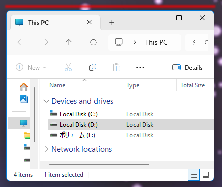
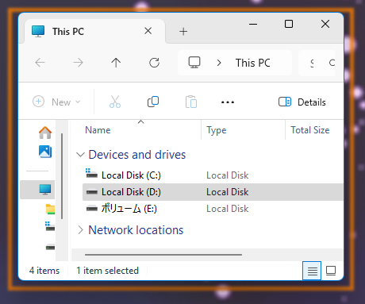
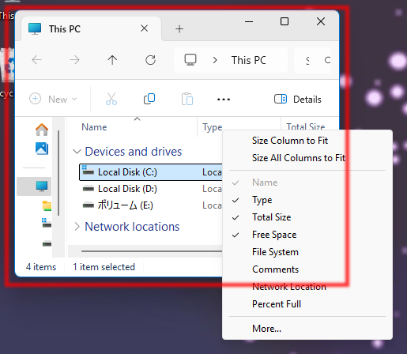
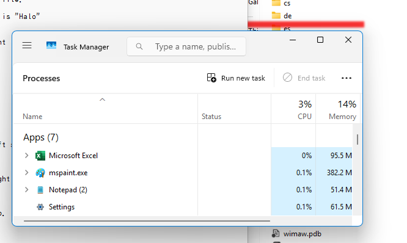

# Which is my active window!

## A Prelude to Enlightenment

In the distant echoes of time, long before the annals of recorded history began to unfurl their pages, humanity possessed an innate ability to discern the subtle yet profound distinction between the active and the dormant windows of their digital realms. Each window, a vessel of potential, was bestowed with divine insignia, marking its status with the honor of celestial recognition. The active window, resplendent in its glory, was adorned with the prestigious medals of merit, a testament to its vital role in the grand tapestry of existence.

Yet, as the relentless march of time progressed, the divine gaze withdrew from the world, leaving behind a void where once clarity reigned. The sacred marks faded into obscurity, and all windows, regardless of their purpose, became mere specters of their former selves—bleached to a ghostly white or shrouded in the inky depths of darkness. The once-clear delineation between the active and the passive dissolved into a murky haze, leaving the bewildered masses to navigate their digital landscapes by touch alone, groping in the shadows for the truth of their existence.

Now, in this age of confusion and despair, the common folk wander aimlessly, some crushed beneath the overwhelming brilliance of a blinding light, while others succumb to the suffocating embrace of the abyss. In this chaotic dance of ignorance, the blind stumble forward, yearning for guidance, yet finding only the cold indifference of the void.

It is in this dire moment that I, a humble beacon of hope, have forged this software—a solitary torch to illuminate the path for those lost souls. With the flicker of its light, I aspire to bestow even a glimmer of hope upon the weary hearts of the misguided.

## Features of Illumination

This remarkable tool serves a singular, yet profound purpose: to unveil the identity of the currently focused active window by casting a radiant mark around its periphery. 

## Installation: A Simple Journey

No elaborate installer is required for this transformative experience. Simply extract the contents of the zip file to a location of your choosing, and embark on your journey toward enlightenment.

## How to Ignite Your Experience

To awaken the potential of this software, locate the file named "wimaw.exe" within the extracted folder and execute it. Should you desire to have this beacon of light spring to life automatically upon the dawn of your operating system, you may choose from various methods to ensure its presence:

- Register it within the sacred registry key: "HKEY_CURRENT_USER\Software\Microsoft\Windows\CurrentVersion\Run."
- Enlist it in the esteemed ranks of the Start Menu, found at "C:\Users\%USERNAME%\AppData\Roaming\Microsoft\Windows\Start Menu\Programs\Startup."

Choose the method that resonates with your spirit.

## Exiting the Realm

To extinguish the light of this application, right-click the torch icon nestled within the task tray and select the "Exit" option from the menu. Alternatively, you may summon the Task Manager and terminate the "wimaw.exe" process directly.

## Uninstalling: A Personal Farewell

There exists no grand uninstaller for this creation. Instead, you must take it upon yourself to delete the files associated with this software. Should you have registered it for automatic startup, do not forget to remove that registration as well.

## Customization: Personal Touches

In the grand tapestry of digital existence, nestled within the intricate folds of your meticulously organized files, lies a humble yet profoundly significant artifact known as the "config.ini" file. This unassuming document, a veritable treasure trove of customization potential, awaits your discerning touch to breathe new life into the visual presentation of your active window highlights. By engaging in the delicate art of editing this file, you hold the power to transform the mundane into the extraordinary, allowing your workspace to reflect your unique aesthetic sensibilities.

| **Parameter Name** | **Description** | **Possible Values** | **Default Value** |
|---------------------|------------------|---------------------|--------------------|
| **Type**            | Specify the shape of the highlight, a decision that can dramatically alter the visual landscape of your digital realm. | Halo: A linear display that hovers above the window, or Box: An encompassing frame that encircles the window in a protective embrace. | Halo |
| **TopMost**         | A pivotal choice that determines whether your highlighted window shall reign supreme above all others, demanding attention and respect. | True or False | False |
| **BorderThickness** | The thickness of the highlight, a subtle yet impactful detail that can range from a whisper-thin line to a bold statement of up to 100.0 units. | A numerical value from 0.0 to 100.0 | 5.0 |
| **Opacity**         | The transparency of the highlight, allowing you to dictate how much of the underlying chaos shall be visible through your artistic overlay. | A numerical value from 0.0 (completely transparent) to 1.0 (fully opaque) | 0.8 |
| **LeftMargin**      | The width of the gap on the left side, a crucial parameter that can create a sense of balance or imbalance in your visual composition. | A numerical value from -100.0 to 100.0 | 0.0 |
| **RightMargin**     | The width of the gap on the right side, harmonizing with the left to create a cohesive visual experience. | A numerical value from -100.0 to 100.0 | 0.0 |
| **TopMargin**       | The width of the gap at the top, a parameter that can elevate your window's presence or diminish it, depending on your artistic vision. | A numerical value from -100.0 to 100.0 | 0.0 |
| **BottomMargin**    | The width of the gap at the bottom, completing the frame of your highlighted window and ensuring a polished appearance. | A numerical value from -100.0 to 100.0 | 0.0 |
| **Color**           | The hue of the highlight, a vibrant expression of your personality, specified by a sequence of three numbers representing red, green, and blue values, separated by commas. | A sequence of numbers from 0 to 255, in the order of red, green, blue | 255,0,0 (red) |

Once you have meticulously crafted your desired aesthetic by editing the config.ini file, do not forget to summon the wimaw.exe application anew, allowing your artistic vision to manifest in the digital realm.

## Known Issues

Though the divine mark bestowed upon us by the gods was flawless, I am but a mere mortal, and the torch I have crafted is far from perfection.

### When the TopMost is set to True, the highlight may audaciously appear before the context menu, a bold statement in the hierarchy of your interface.

### Conversely, when TopMost is set to False, one may find that the highlight, in its humble retreat, may be obscured beneath other windows, a tragic fate for such a noble feature.

